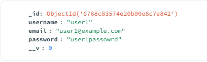
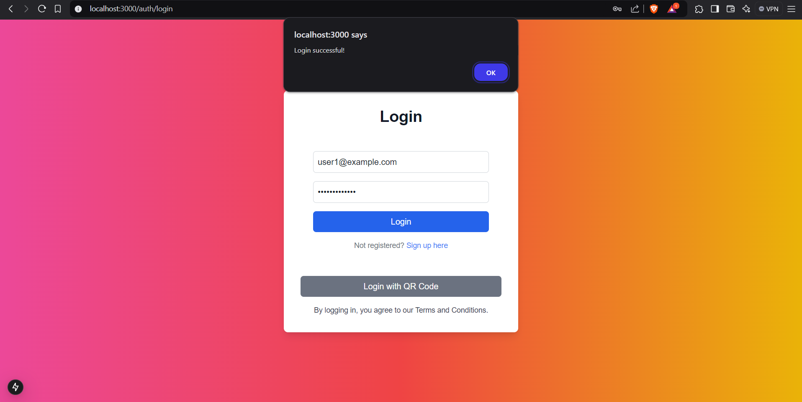
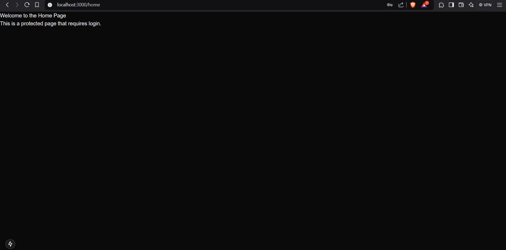
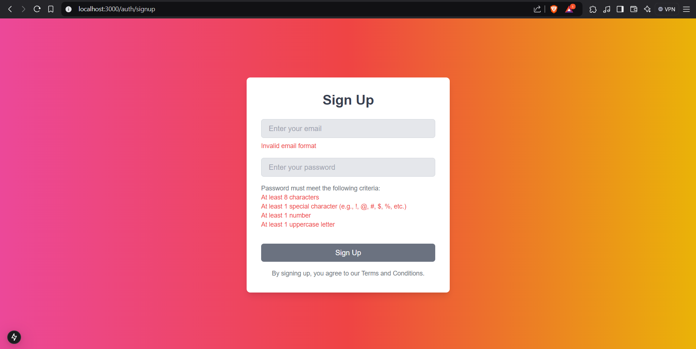
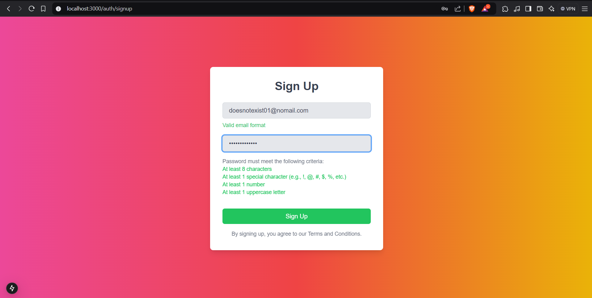

# Web Assignment

This is a [**Next.js**](https://nextjs.org/) project built to demonstrate the frontend development skills for task management with a login page, sign-up functionality, and dynamic form validation.

## Problem Statement
Create a web application with a visually appealing login and sign-up interface, including dynamic validation for both email and password fields.

## Features
- **Login Screen**: Allows users to log in with email and password, with validation for both fields.
- **Sign Up Screen**: Allows new users to register with email and password, with real-time password validation rules (minimum length, special character, number, uppercase letter).
- **Dynamic Email Validation**: Displays real-time validation for the email field, including checking for a valid email format.
- **Password Strength Validation**: Real-time password strength check with rules for length, special character, number, and uppercase letter.

## Approach
1. Used **Next.js** for server-side rendering and routing.
2. Implemented **React state** and **useEffect hooks** for dynamic validation of email and password.
3. Used **Tailwind CSS** for responsive and modern styling of the UI elements.
4. Designed real-time validation feedback for both the email and password fields.
5. Used the next/navigation package for routing in Client Components.

## Execution
- **Screens**:
  - **Login**: Users can log in with valid credentials (email and password).
  - **Sign Up**: New users can sign up with email and password, with real-time feedback for password strength.
  - **Home**: After a successful login, users are redirected to a protected home page.
- **Validation**:
  - Email validation checks for correct format and availability (UI feedback).
  - Password validation checks for length, special character, number, and uppercase letter.
- **UI**: Clean and minimal design with responsive layouts using Tailwind CSS.

## Requirements
- Node.js
- Dependencies:
  - `next`
  - `react`
  - `react-dom`
  - `tailwindcss`
- Backend to be running. You can find the repo for the same on my github profile under the repo called assignment_backend. Follow the instructions given there and run the backend

## Installation
1. Clone the repository:
   ```bash
   git clone <repository-url>
   ```
2. Install dependencies:
   ```bash
   npm install
   ```
3. Start the development server:
   ```bash
   npm run dev
   ```

## Usage
1. Launch the app in your browser at `http://localhost:3000`.
2. Navigate between the login and sign-up screens.
3. Enter a valid email and a password that meets all the criteria to successfully sign up or log in.
4. Observe real-time validation feedback on both the email and password fields.
5. After logging in, you will be redirected to the Home page, which is a protected page accessible only to logged-in users.

## Project Structure
```
src/
|-- app/
|   |-- auth/            
|   |   |-- login/   
|   |   |   |-- page.tsx    
|   |   |-- signup/       
|   |   |   |-- page.tsx     
|   |   |-- components/    
|   |   |   |-- SignUpForm.tsx
|   |   |   |-- LoginForm.tsx
|   |   |   |-- QRCodeLogin.tsx
|   |   |   |-- PasswordStrengthChecker.tsx
|   |-- home/               
|   |   |-- page.tsx        
|-- utils/                   
|   |-- api.ts               
|   |-- validatePassword.ts  
|-- styles/
|   |-- globals.css          
|   |-- tailwind.config.js   
|-- public/
|   |-- assets/             
|-- next.config.js          
```

## Learn More

To learn more about Next.js, check out the following resources:

- [Next.js Documentation](https://nextjs.org/docs) - Learn more about Next.js features and API.
- [Tailwind CSS Documentation](https://tailwindcss.com/docs) - Learn about styling with Tailwind CSS.
- [React Documentation](https://reactjs.org/docs/getting-started.html) - Get started with React and its core concepts.


## Relevant screenshots : 

1. Welcome page


2. Login Page


Enter a valid email and password to login. Here is an example user stored in mongodb : 



Upon entering the correct combination of email and password, you will get a success message : 



3. Home Page after logging in : 



4. Alternate login option : QR Code


5. Sign up page : 



Once you enter all fields correctly, you will be able to sign up. 



