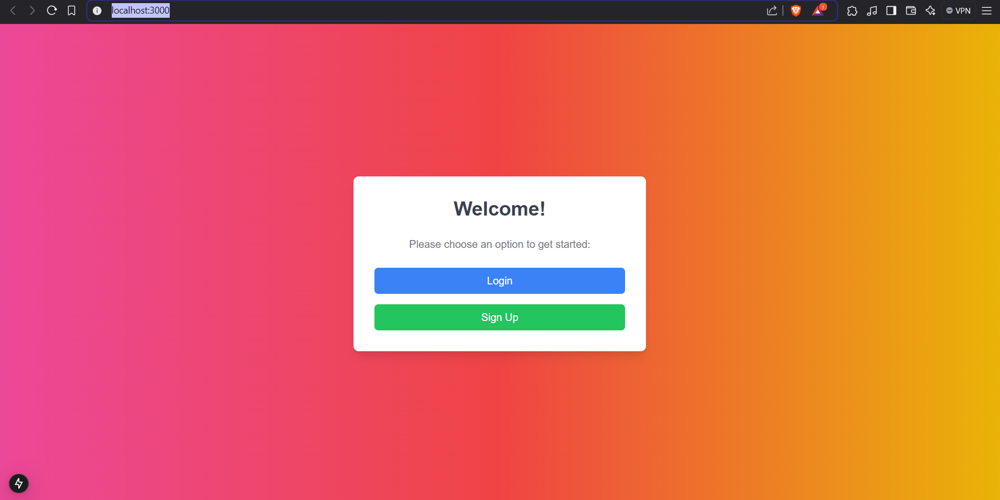
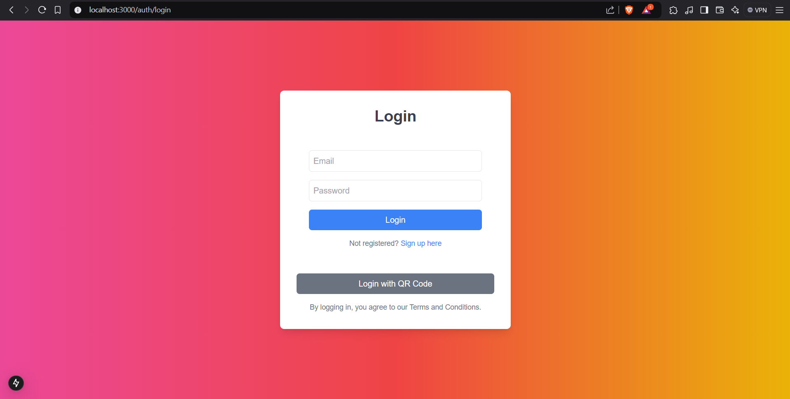
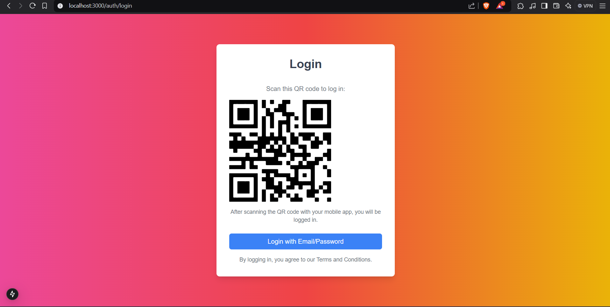

This is a [Next.js](https://nextjs.org) project bootstrapped with [`create-next-app`](https://nextjs.org/docs/app/api-reference/cli/create-next-app).

## Problem Statement : 
To design a static login page completely using AI

## Prerequisites : 
1. Node.js and npm
2. git for version control

## Requirements : 
Login page where the user can login with a username/email and password combination

## Approach : 
1. Created a new Next.js project with npx create-next-app.

2. Configured Tailwind CSS for styling.

3. Used ChatGPT to generate the entire code needed. Tried a bit of prompting to make the page visually appealing and having additional ways of logging in to make the process convenient. 

4. Verified the app by running it locally using the command npm run dev

## Relevant screenshots : 

